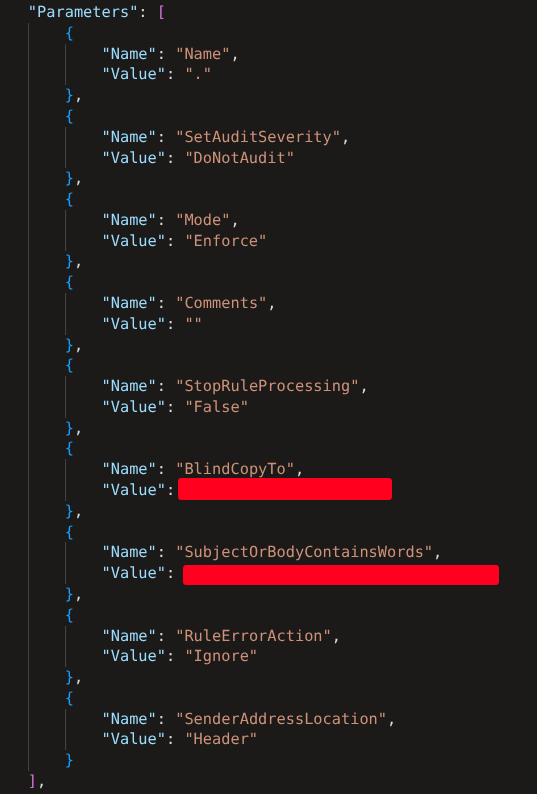

# Converting an array with multiple JSON to a single JSON

While working with Unified Audit Logs (this can be found in other Microsoft product logs as well) I came accross the image multiple times and it is extremely annoying to work with this format.




Because I suspect many of you have the same issue here are some KQL snippets you can use for managing these annoying log fields. 

It is important for the `| summarize Params=make_set(Params), arg_max(TimeGenerated,*) by id` to summarize a unique value by a unique value to preperly create a new set with the parameters. For my case this was a unique log id, if used outside the context of UAL you might want to find another unique value.


### UAL - Parameters
#### 1st method
```
| extend Parameters=AuditData.Parameters
| mv-apply Params=Parameters on (
    extend Params=parse_json(strcat('{"',tostring(Params.Name),'":' ,'"',tostring(Params.Value),'"}'))
)
| summarize Params=make_set(Params), arg_max(TimeGenerated,*) by id
| extend Params=parse_json(replace_string(replace_string(strcat("{ ",replace_string(replace_string(tostring(Params),"{",""),"}","")," }"),"[",""),"]",""))
```

#### 2nd method
This will only show you the collumns, so you might want to join this with the original results.

This method is not recommended because pivot generates a dynamic set of columns, so later action might fail because a column is missing.

```
| extend Parameters=AuditData.Parameters
| mv-expand Parameters
| extend TableName=tostring(Parameters.Name), Value=tostring(Parameters.Value)
| evaluate pivot(TableName,take_any(Value),id)
```

### UAL - DeviceProperties
```
| extend DeviceProperties=AuditData.DeviceProperties
| mv-apply DeviceProperties=DeviceProperties on (
    extend DeviceProperties=parse_json(strcat('{"',tostring(DeviceProperties.Name),'":' ,'"',tostring(DeviceProperties.Value),'"}'))
)
| summarize DeviceProperties=make_set(DeviceProperties), arg_max(TimeGenerated,*) by id
| extend DeviceProperties=parse_json(replace_string(replace_string(strcat("{ ",replace_string(replace_string(tostring(DeviceProperties),"{",""),"}","")," }"),"[",""),"]",""))
```