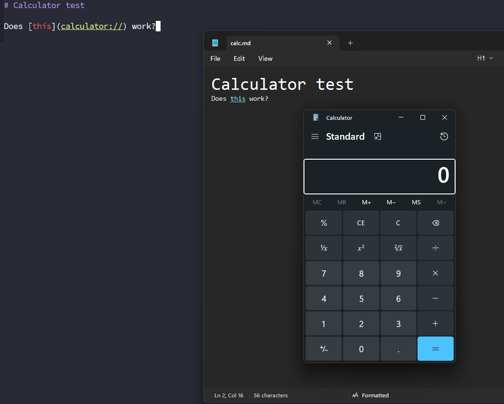

# CVE-2026-20841

## Intro
On 2026-02-10 Microsoft released the following advisory about a vulnerability. From Microsoft *`Improper neutralization of special elements used in a command ('command injection') in Windows Notepad App allows an unauthorized attacker to execute code over a network.`*. This results in allowing Threat Actors to execute code from the internet when the a user clicks a malicious link inside a markdown file opened with `notepad.exe`.


## Expected outcomes and suggested actions

It should not be expected for `powershell.exe`,`cmd.exe` or any other command line tools to run as a child process of `notepad.exe`. Since this hunt is based on a POC it unclear if it is possible for the malicious link to run bundled executables or code from download cradles. In any case, any hits should be investigated and links inside the CommandLine parameters checked.

## Additional Info

- https://nvd.nist.gov/vuln/detail/CVE-2026-20841
- https://msrc.microsoft.com/update-guide/vulnerability/CVE-2026-20841
- POC by MTTaggart https://infosec.exchange/@mttaggart/116053131980991105 


## Kusto Query

``` 
DeviceProcessEvents
| where InitiatingProcessFileName =~ "notepad.exe"
| where FileName !~ "notepad.exe"
| where TimeGenerated > ago(90d)
| extend InitiatingProcessCommandLine=tolower(InitiatingProcessCommandLine)
| extend OpenedFile=tostring(split(InitiatingProcessCommandLine,'"notepad.exe" ')[1])
| extend OpenedFile=replace_string(OpenedFile,'"','')
| extend OpenedFileExtention=tostring(split(tostring(split(OpenedFile,@"\")[-1]),".")[-1])
| where OpenedFileExtention =~ "md"
| summarize min(TimeGenerated), max(TimeGenerated) by DeviceId, DeviceName, AccountDomain, AccountName, FileName, ProcessCommandLine, InitiatingProcessFileName, InitiatingProcessCommandLine, OpenedFile, OpenedFileExtention
```

## Mitre Att&ck Techniques

- Initial Access - [T566.001 - Spearphishing Attachment](https://attack.mitre.org/techniques/T1566/001/)
- Execution - [T1203 - Exploitation for Client Execution](https://attack.mitre.org/techniques/T1203/)